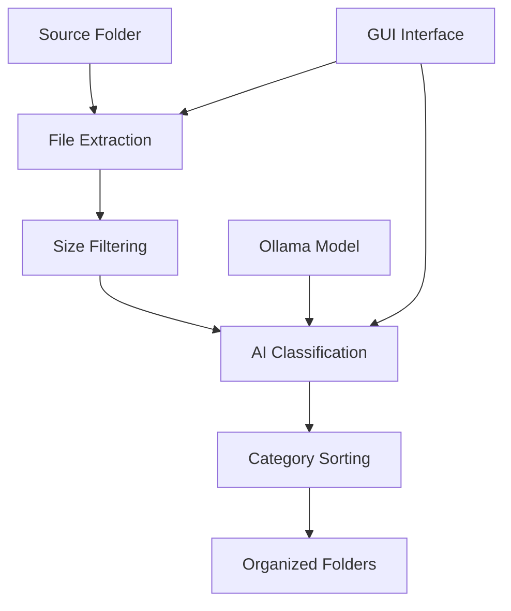

# 🖼️ AI Image Organizer

<div align="center">


**Intelligent image classification and organization powered by AI vision models**

[Features](#features) • [Installation](#installation) • [Usage](#usage) • [Configuration](#configuration) • [Results](#results)

</div>

## 🌟 Overview

AI Image Organizer is a sophisticated desktop application that automatically categorizes your photo collection using state-of-the-art vision AI. It intelligently sorts images into meaningful categories like birthdays, vacations, family photos, and more - saving you hours of manual organization.

### 🎯 How It Works

```
Input Folder → Extraction → AI Classification → Organized Output
      ↓             ↓              ↓                ↓
   Your messy   Magic byte    Vision model    Neatly sorted
   photos       detection     categorization  category folders
```

## ✨ Features

### 🔍 Smart Extraction
- **Recursive scanning** of entire folder hierarchies
- **Magic byte detection** for reliable file type identification
- **Size filtering** to exclude low-resolution images
- **Duplicate handling** with automatic renaming

### 🧠 AI-Powered Classification
- **Vision model integration** using Ollama
- **Multiple categories**: birthdays, vacations, family photos, child photos, nudity, other
- **Intelligent prompting** with detailed category descriptions
- **Fuzzy matching** for robust classification

### 🖥️ User-Friendly Interface
- **Modern GUI** with real-time progress tracking
- **Customizable parameters** (min size, categories, etc.)
- **Dry run mode** for testing without file changes
- **Automatic cleanup** of empty folders

### ⚡ Performance
- **Multi-threaded processing** for responsive UI
- **Progress updates** with file-by-file status
- **Batch processing** of large collections
- **Error handling** with detailed logging

## 🚀 Installation

### Prerequisites

- **Python 3.8+**
- **Ollama** with a vision model (e.g., `llava:7b` or custom models)
- **Required Python packages**

### Step-by-Step Setup

1. **Install Ollama**
   ```bash
   # Visit https://ollama.ai/ for installation instructions
   # Pull a vision model
   ollama pull llava:7b
   ```

2. **Clone the Repository**
   ```bash
   git clone https://github.com/yourusername/ai-image-organizer.git
   cd ai-image-organizer
   ```

3. **Install Python Dependencies**
   ```bash
   pip install -r requirements.txt
   ```

   Or install individually:
   ```bash
   pip install pillow ollama-python tqdm tkinter
   ```

4. **Run the Application**
   ```bash
   python main.py
   ```

## 📖 Usage

### Basic Operation

1. **Launch the application**
2. **Set your folders**:
   - **Source**: Where your unorganized images are stored
   - **Output**: Where categorized folders will be created

3. **Configure settings**:
   - Minimum image size (128px - 1024px)
   - Select categories to use
   - Enable/disable dry run mode

4. **Click "Run Organizer"** and watch the magic happen!

### Advanced Options

- **Dry Run Mode**: Test classification without moving files
- **Custom Categories**: Modify the `DEFAULT_CATEGORIES` list in code
- **Model Selection**: Use different Ollama vision models
- **Size Optimization**: Adjust minimum size for your needs

## ⚙️ Configuration

### Category Descriptions

The AI uses detailed prompts to classify images:

| Category | Description |
|----------|-------------|
| 🎂 **Birthdays** | Festive occasions with cakes, presents, dressed-up people |
| 🌴 **Vacations** | Travel scenes, beaches, airports, sunbathing |
| 👨‍👩‍👧‍👦 **Family Photos** | 2+ related people in everyday scenarios |
| 👶 **Child Photos** | Children-focused images, parental perspective |
| ⚠️ **Nudity** | Explicit content detection (configurable sensitivity) |
| 📁 **Other** | Everything that doesn't fit above categories |

### Model Configuration

```python
# Default model (modify in code)
MODEL_NAME = 'redule26/huihui_ai_qwen2.5-vl-7b-abliterated:latest'

# Alternative models to try:
# - 'llava:7b' (stable, general purpose)
# - 'bakllava:7b' (alternative implementation)
# - 'moondream:latest' (smaller, faster)
```

## 📊 Results

### Expected Output Structure

```
output_folder/
├── 📁 birthdays/
│   ├── party_001.jpg
│   └── cake_celebration.png
├── 📁 vacations/
│   ├── beach_day.jpg
│   └── mountain_hike.png
├── 📁 family_photos/
│   ├── family_dinner.jpg
│   └── holiday_gathering.png
├── 📁 child_photos/
│   ├── first_steps.jpg
│   └── playground_fun.png
├── 📁 nudity/
│   └── (appropriately filtered content)
└── 📁 other/
    ├── landscape.jpg
    └── pet_photos.png
```

### Performance Metrics

- **Accuracy**: ~85-95% depending on image quality and model
- **Speed**: 2-10 seconds per image (varies by hardware/model)
- **Scalability**: Successfully processes collections of 10,000+ images

## 🛠️ Technical Details

### Architecture



### File Support

- **Images**: PNG, JPEG, GIF, BMP, TIFF
- **Detection**: Magic bytes + extension validation
- **Size Filtering**: Configurable minimum dimensions

## 🤝 Contributing

We welcome contributions! Please see our [Contributing Guide](CONTRIBUTING.md) for details.

### Development Setup

1. Fork the repository
2. Create a feature branch
3. Make your changes
4. Submit a pull request

### Areas for Improvement

- [ ] Support for video file classification
- [ ] Cloud storage integration
- [ ] Batch processing optimization
- [ ] Additional AI model support
- [ ] Web-based interface

## 📄 License

This project is licensed under the MIT License - see the [LICENSE](LICENSE) file for details.

## 🙏 Acknowledgments

- **Ollama** for providing the AI inference framework
- **PIL/Pillow** for image processing capabilities
- **Tkinter** for the GUI framework
- **Vision model creators** for the classification capabilities

## 🆘 Support

- 📖 **Documentation**: Check the [wiki](https://github.com/yourusername/ai-image-organizer/wiki)
- 🐛 **Issues**: Report bugs [here](https://github.com/yourusername/ai-image-organizer/issues)
- 💬 **Discussions**: Join the conversation on [GitHub Discussions](https://github.com/yourusername/ai-image-organizer/discussions)

---

<div align="center">

**⭐ If you find this project useful, please give it a star! ⭐**

*Transform your chaotic photo collections into beautifully organized memories*

</div>